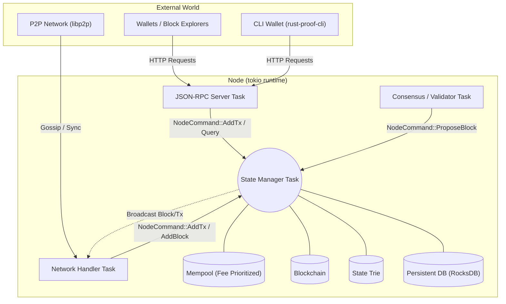

# The End State: Architecture & Features

This document outlines the final architecture and feature set of the `rust-proof` blockchain. This is a **mega project**—a full-fledged, production-like Proof of Stake (PoS) blockchain built from scratch in Rust.

## Core Features

By the end of this project, you will have built a fully functional, decentralized PoS blockchain node featuring:

1.  **Advanced Cryptography & Serialization:**
    *   Deterministic binary serialization (`ToBytes`).
    *   SHA-256 hashing for unique identification and Merkle Tree generation.
    *   Ed25519 digital signatures for transaction authorization and validator consensus.

2.  **Robust State Management & Storage:**
    *   Account-based state model (balances, nonces).
    *   **Merkle Trees:** Cryptographic state roots to prove account balances without downloading the whole chain.
    *   **Persistent Storage:** Integration with a Key-Value store (e.g., `rocksdb` or `sled`) to persist blocks, transactions, and state across node restarts.

3.  **Full Proof of Stake (PoS) Consensus:**
    *   **Epochs & Slots:** Time is divided into epochs and slots. Validators are pseudo-randomly selected to propose blocks for specific slots based on their stake.
    *   **Staking Mechanics:** Special transactions to `Stake` (lock up funds to become a validator) and `Unstake` (withdraw funds after a cooldown period).
    *   **Slashing:** Cryptographic proofs to penalize validators who misbehave (e.g., double-signing two different blocks in the same slot).
    *   **Fork Choice Rule:** Logic to determine the canonical chain when network partitions occur (e.g., heaviest stake/longest chain).

4.  **Mempool & Fee Market:**
    *   Transaction prioritization based on gas/fees.
    *   Eviction policies for stale or low-fee transactions when the mempool is full.

5.  **Concurrent Node Architecture (Actor Model):**
    *   Multi-threaded design using `tokio`.
    *   Message passing via MPSC channels for lock-free, thread-safe state mutations.

6.  **Peer-to-Peer Networking (libp2p):**
    *   Kademlia DHT for decentralized peer discovery.
    *   Gossipsub protocol for broadcasting transactions and blocks.
    *   **Chain Syncing:** Mechanisms for new nodes to request and download historical blocks from peers.

7.  **JSON-RPC API:**
    *   An HTTP server allowing external clients (wallets, block explorers) to interact with the node.

## System Architecture

The node is divided into several distinct, concurrent components (tasks) that communicate via channels.

## Module Breakdown & Key Functions

To achieve this, the codebase will be structured into the following core modules:

### 1. `crypto`
Handles all cryptographic operations.
*   `fn hash<T: ToBytes>(data: &T) -> [u8; 32]`
*   `fn sign(keypair: &Keypair, message: &[u8]) -> Signature`
*   `fn verify(pubkey: &PublicKey, message: &[u8], sig: &Signature) -> bool`

### 2. `models`
Defines the core data structures.
*   `struct Transaction`: Includes `sender`, `receiver`, `amount`, `fee`, `nonce`, `tx_type` (Transfer, Stake, Unstake), and `signature`.
*   `struct Block`: Includes `height`, `previous_hash`, `state_root`, `timestamp`, `proposer`, `transactions`, and `signature`.
*   `struct Receipt`: Logs the outcome of a transaction (success/failure, gas used).

### 3. `state`
Manages the ledger and account balances.
*   `fn apply_block(&mut self, block: &Block) -> Result<StateRoot, Error>`
*   `fn verify_tx(&self, tx: &Transaction) -> Result<(), Error>`
*   `fn update_balance(&mut self, account: &PublicKey, amount: i64)`
*   `fn compute_state_root(&self) -> [u8; 32]` (Merkle Trie integration)

### 4. `consensus` (Proof of Stake)
Implements the rules of the PoS protocol.
*   `fn select_proposer(epoch: u64, slot: u64, active_validators: &ValidatorSet) -> PublicKey`
*   `fn verify_block_time_and_proposer(&self, block: &Block) -> bool`
*   `fn handle_slash(&mut self, proof_of_malfeasance: &SlashProof)`
*   `fn update_validator_set(&mut self, epoch: u64)`

### 5. `mempool`
Manages unconfirmed transactions.
*   `fn add_tx(&mut self, tx: Transaction) -> Result<(), Error>`
*   `fn get_pending_txs(&self, max_size: usize) -> Vec<Transaction>` (Sorted by fee)
*   `fn evict_stale_txs(&mut self, current_nonces: &HashMap<PublicKey, u64>)`

### 6. `storage`
Handles persistent data using a Key-Value database.
*   `fn save_block(&self, block: &Block) -> Result<(), Error>`
*   `fn get_block_by_hash(&self, hash: &[u8; 32]) -> Option<Block>`
*   `fn save_state_node(&self, hash: &[u8; 32], data: &[u8])`

### 7. `network`
Manages P2P connections and gossip.
*   `fn broadcast_transaction(&self, tx: &Transaction)`
*   `fn broadcast_block(&self, block: &Block)`
*   `fn request_sync(&self, from_height: u64, target_peer: &PeerId)`

### 8. `rpc`
Exposes the node's functionality to the outside world.
*   `async fn send_raw_transaction(tx_bytes: Vec<u8>) -> Result<TxHash, Error>`
*   `async fn get_balance(address: PublicKey) -> Result<u64, Error>`
*   `async fn get_block_by_number(height: u64) -> Result<Block, Error>`

## The Learning Journey (Chapter Roadmap)

This mega project is broken down into a series of chapters, each focusing on specific Rust concepts and blockchain domain knowledge.

### Chapter 1: Cryptography, Serialization, and Core Data Structures
*   **Focus:** Traits, Blanket Implementations, Memory Layout, Basic Borrowing.
*   **What you build:** The `crypto` and `models` modules. You implement custom `ToBytes` and `Hashable` traits, and define the basic `Transaction` and `Block` structs.

### Chapter 2: State Management and The Ledger
*   **Focus:** Structs, HashMaps, Mutability, Error Handling, The Borrow Checker.
*   **What you build:** The initial `state` module. You create an in-memory state machine that tracks account balances and nonces, and validates transactions against these rules.

### Chapter 3: Concurrency, Channels, and the Node Architecture
*   **Focus:** `tokio`, Async/Await, Message Passing (MPSC/oneshot channels), Actor Model.
*   **What you build:** The core `node` architecture. You create the State Manager task that exclusively owns the blockchain state and processes commands concurrently from other parts of the system. You will also write the `main.rs` entry point to boot up the `tokio` runtime and start the node, allowing you to run the binary for the first time.

### Chapter 4: Proof of Stake Consensus (Simplified)
*   **Focus:** Enums as Data Structures, Pattern Matching (`match` / `if let`), Iterators, Determinism.
*   **What you build:** You refactor the `Transaction` model to support both `Transfer` and `Stake` operations using enums. You update the `State` to track validator stakes and implement a deterministic, round-robin algorithm to select the next block proposer.

### Chapter 5: Persistent Storage and Merkle Trees
*   **Focus:** External Crates (e.g., `rocksdb`), Trait Objects (`Box<dyn Storage>`), Advanced Data Structures.
*   **What you build:** The `storage` module. You move from in-memory HashMaps to a persistent Key-Value store. You also implement a Merkle Trie to compute cryptographic state roots.

### Chapter 6: The Mempool and Fee Markets
*   **Focus:** `BTreeMap` / `BinaryHeap` for sorting, Custom Ordering (`Ord`, `PartialOrd`), Lifetimes.
*   **What you build:** The `mempool` module. You implement a priority queue for pending transactions based on gas fees, and logic to evict stale transactions.

### Chapter 7: Advanced Proof of Stake (Epochs & Slashing)
*   **Focus:** Complex State Mutations, Cryptographic Proofs, Time/Duration handling, Fork Choice Rules.
*   **What you build:** You upgrade the consensus engine from Chapter 4. You implement Epochs and Slots, introduce `Unstake` transactions with cooldown periods, and build the logic to detect and slash validators who double-sign blocks. You also implement the "Heaviest Chain" fork choice rule.

### Chapter 8: Peer-to-Peer Networking
*   **Focus:** `libp2p`, Streams, Network Protocols, Complex Async State Machines.
*   **What you build:** The `network` module. You implement node discovery (Kademlia DHT), block/transaction gossiping (Gossipsub), and chain synchronization protocols.

### Chapter 9: JSON-RPC API
*   **Focus:** Web Frameworks (e.g., `axum` or `warp`), Serialization (`serde` for JSON), Error Mapping.
*   **What you build:** The `rpc` module. You expose an HTTP server that allows external wallets and block explorers to query the state and submit transactions.

### Chapter 10: The Command Line Interface (CLI)
*   **Focus:** Argument Parsing (`clap`), Terminal UI, Interacting with APIs.
*   **What you build:** A separate binary (`src/main.rs` or a new crate) that acts as a wallet and node controller. You will build commands to generate keypairs, construct and sign transactions, and send them to the node via the JSON-RPC API.

By completing this journey, you will master:
*   **Advanced Rust Ownership & Lifetimes:** Managing complex, interconnected data structures across threads and asynchronous boundaries.
*   **Fearless Concurrency:** Using `tokio` and channels to build a highly concurrent system without deadlocks or race conditions.
*   **Trait-Based Design:** Using traits to define behavior (like `ToBytes` and `Hashable`) and applying trait bounds to generic types.
*   **Advanced Error Handling:** Managing errors across asynchronous boundaries.
*   **Network Programming:** Building robust P2P protocols with `libp2p`.
*   **Cryptographic Engineering:** Safely implementing hashing, signatures, and Merkle trees.
