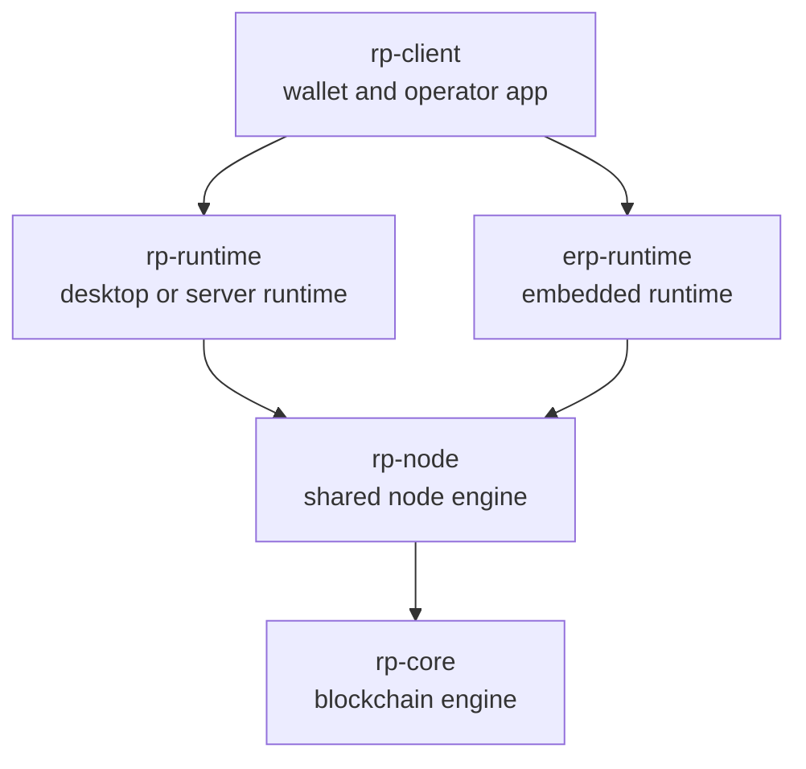

# Architecture

This document describes the target architecture of the `rust-proof` system after the current mixed crate is split into shared engines and runtimes.

## 1. System shape

The target system is built from five logical crates:

- `rp-core`
- `rp-node`
- `rp-runtime`
- `erp-runtime`
- `rp-client`

The architecture is intentionally layered.

## 2. `rp-core`

`rp-core` is the canonical blockchain engine.

It should own:

- transaction and block rules
- canonical encoding
- hashing
- state transition
- fork-choice inputs and outputs
- validation errors

It should not own:

- peer state
- sync orchestration
- transports
- storage backends
- runtime shells
- wallet UX

## 3. `rp-node`

`rp-node` is the canonical node engine.

It should own:

- peer tracking
- sync state
- import orchestration
- mempool admission policy
- protocol message handling
- capability negotiation
- runtime-facing boundaries for transport, storage, clock, wake, and identity

It should not own:

- OS sockets
- embedded network drivers
- filesystem or flash implementations
- process lifecycle
- web serving

## 4. `rp-runtime`

`rp-runtime` is the desktop or server runtime shell.

It should host `rp-node` and provide:

- transport integration
- storage integration
- timers and wake delivery
- observability
- optional runtime-local APIs
- optional wallet web hosting

## 5. `erp-runtime`

`erp-runtime` is the embedded runtime shell.

It should host the same `rp-node` and provide:

- embedded transport integration
- bounded storage integration
- device timing and wake integration
- node identity integration
- constrained memory policy
- optional hosting of a wallet webpage from device storage

The embedded runtime is a peer runtime, not a second-class client.

## 6. `rp-client`

`rp-client` is the wallet and operator application.

It should own:

- wallet UX
- CLI commands
- transaction construction and signing
- diagnostics and operator workflows
- optional static web assets

It should not become the canonical source of node behavior.

## 7. Node engine boundary

The shared node engine should be event-driven.

Typical input classes:

- peer connected
- peer disconnected
- frame received
- local transaction submitted
- timer fired
- storage loaded

Typical output classes:

- send frame
- broadcast frame
- persist block or snapshot
- request blocks
- schedule wake
- emit structured engine event

This style makes the node engine usable in both host and embedded runtimes.

## 8. Protocol stance

The architecture does not require the node engine itself to be tied to a specific transport framework.

A runtime may choose its own transport implementation as long as it can satisfy the node-engine boundary.

That keeps the protocol and node behavior shared even if runtime transport details differ.

## 9. Wallet web hosting

A runtime may optionally host a wallet webpage.

If that feature is added, the recommended model is:

- wallet UI is built from `rp-client`
- runtime serves the static assets
- key material stays under runtime or device control by default

This keeps wallet UX separate from node logic while still supporting device-hosted wallet pages.
